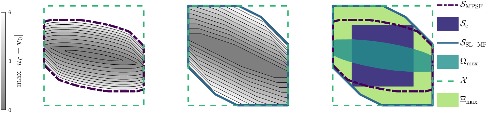

# Predictive safety filter using system level synthesis
This repository contains the MATLAB code that accompanies the research paper:
> Leeman AP., Köhler J., Bennani S., Zeilinger MN. “Predictive safety filter using system level synthesis.” 
> Accepted L4DC2023 (2023)

This repository contains the MATLAB implementation of the System Level Synthesis based Model Predictive Safety Filter (SL-MPSF) scheme presented in our paper. This novel approach to safety filters enhances the safety of control systems, especially those using learning-based controllers or human inputs, by ensuring constraint satisfaction.

Our code provides an implementation of an improved Model Predictive Safety Filter (MPSF) formulation that integrates System Level Synthesis (SLS) techniques. The resulting SL-MPSF scheme guarantees safety for linear systems that are subject to bounded disturbances and provides an enlarged safe set. Compared to conventional MPSF formulations, our approach requires fewer and less severe modifications of potentially unsafe control inputs to certify safety.

Additionally, this repository includes an implementation of an explicit variant of the SL-MPSF formulation. This variant maintains the scalability of the SL-MPSF scheme while reducing the required online computational effort, which is a major drawback of traditional MPSF approaches.

The code contains a numerical example demonstrating the advantages of our SL-MPSF formulations over state-of-the-art MPSF formulations.



The paper is freely available on [arXiv](https://arxiv.org/abs/2212.02111).

## Prerequisites
- MATLAB (tested with version R2020b)
- Multi-Parametric Toolbox 3 (MPT3)
- MOSEK

## Installation
1. Download and install MATLAB from the [official website](https://www.mathworks.com/products/matlab.html).

2. Install Mosek by following the instructions from the [official Mosek documentation](https://docs.mosek.com/9.2/install/installation.html). 

3. Install the Multi-Parametric Toolbox 3 (MPT3) by following the instructions from the [official MPT3 documentation](https://www.mpt3.org/). In summary, you will need to:
    
4. Clone this repository or download the code as a ZIP archive and extract it to a folder of your choice.

5. Add the code folder to your MATLAB path by running the following command in the MATLAB Command Window:
    
        addpath('/path/to/your/code/folder');
    
## Usage

Run the main script (i.e., main.m) to execute the algorithms and models discussed in the paper. Refer to the comments and documentation within the code for further details on the implementation.

## License

This project is licensed under the MIT License.

## Citation

If you use this code in your research, please cite our paper:
  ```
  @article{leeman2022predictive,
  title={Predictive safety filter using system level synthesis},
  author={Leeman, Antoine P and K{\"o}hler, Johannes and Benanni, Samir and Zeilinger, Melanie N},
  journal={arXiv preprint arXiv:2212.02111},
  year={2022}
  }
  ```
  

## Support and Contact

For any questions or issues related to this code, please contact the author:

- Antoine Leeman: aleeman(at)ethz(dot)ch

We appreciate any feedback, bug reports, or suggestions for improvements.
